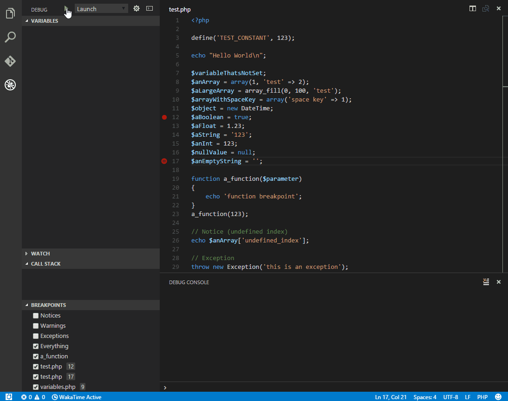

PHP Debug adapter for Visual Studio Code
========================================

[](https://github.com/felixfbecker/vscode-php-debug/releases/latest) [](https://travis-ci.org/felixfbecker/vscode-php-debug)  [](https://gitter.im/felixfbecker/vscode-php-debug?utm_source=badge&utm_medium=badge&utm_campaign=pr-badge)



How to install
--------------

### Install extension:
Press `F1`, type `ext install php-debug`.

### Install XDebug:
[Download and install the XDebug extension](http://xdebug.org/download.php).
Then, in addition to `zend_extension=path/to/xdebug`, add these lines to your php.ini to enable remote debugging:

```ini
[XDebug]
xdebug.remote_enable = 1
xdebug.remote_autostart = 1
```
For web projects, if you haven't already, point your webserver's webroot to your project and don't forget to restart your webserver after you made these changes.
Now, everytime you do a request to a PHP file, XDebug will automatically try to connect to port 9000 for debugging.

### Start debugging:
In your project, go to the debugger and hit the little gear icon. Choose PHP. A new launch configuration will be created for you.
Now, if you select the _Listen for XDebug_ configuration and hit `F5`, VS Code will listen on port 9000 for incoming XDebug requests.
When you make a request to `localhost` with your webbrowser or run a script from the command line, XDebug will connect to VS Code and you can debug your PHP.

For CLI scripts, you can set the same options the Node debugger supports: `program`, `runtimeExecutable`, `runtimeArgs`, `args`, `cwd`, `env` and `externalConsole` (see IntelliSense for descriptions).
The default configuration includes one that runs the currently opened script as an example.

What is supported?
------------------
 - Line breakpoints
 - Conditional breakpoints
 - Function breakpoints
 - Step over, step in, step out
 - Break on entry
 - Breaking on uncaught exceptions and errors / warnings / notices
 - Multiple, parallel requests (Still buggy, see [Microsoft/vscode#1703](https://github.com/Microsoft/vscode/issues/1703))
 - Stack traces, scope variables, superglobals, user defined constants
 - Arrays & objects (including classname, private and static properties)
 - Debug console
 - Watches
 - Run as CLI

Remote Host Debugging
---------------------
If you want to debug a running application on a remote host, you have to set the `localSourceRoot` and `serverSourceRoot` settings in your launch.json.
Example:
```json
"serverSourceRoot": "/var/www/myproject",
"localSourceRoot": "${workspaceRoot}/src"
```
Both paths are normalized, so you can use slashes or backslashes no matter of the OS you're running.

Troubleshooting
---------------
When you are facing problems, please don't send me private emails, instead ask on
[Gitter](https://gitter.im/felixfbecker/vscode-php-debug) or if you think there is a bug in the adapter, [open an issue](https://github.com/felixfbecker/vscode-php-debug/issues).
If it fails with your ultra-awesome MVC app, please first try it on a dead-simple test.php (like the one in the [testproject](https://github.com/felixfbecker/vscode-php-debug/tree/master/testproject)). Please provide some info by setting `xdebug.remote_log = /path/to/logfile` in your php.ini (you will need to restart your webserver), `"log": true` in your launch.json and posting the two logs.

FAQ
---

#### Where are the variables of the parent scope?
In opposite to Javascript, PHP does not have closures.
A scope contains only variables that have been declared, parameters and imported globals with `global` or `use`.
If you want to see the variables of the scope of the callee, click on it in the stacktrace.

Contributing
------------
To hack on this adapter, clone the repository and open it in VS Code.
You can debug it (run it in "server mode") by selecting the "Debug adapter" launch configuration and hitting `F5`.
Then, open a terminal inside the project, and open the included testproject with VS Code while specifying the current directory as `extensionDevelopmentPath`:

```sh
code testproject --extensionDevelopmentPath=.
```

VS Code will open an "Extension Development Host" with the debug adapter running. Open `.vscode/launch.json` and
uncomment the `debugServer` configuration line. Hit `F5` to start a debugging session.
Now, you can debug the testproject like specified above and set breakpoints inside your first VS Code instance to step through the adapter code.

